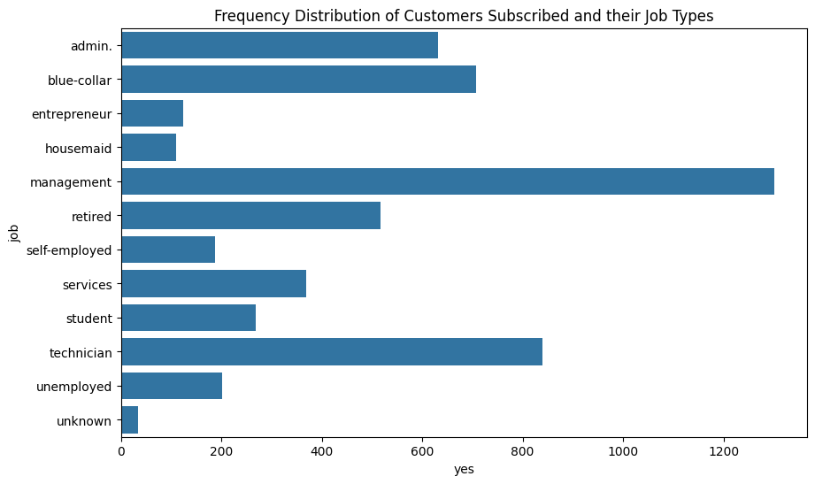
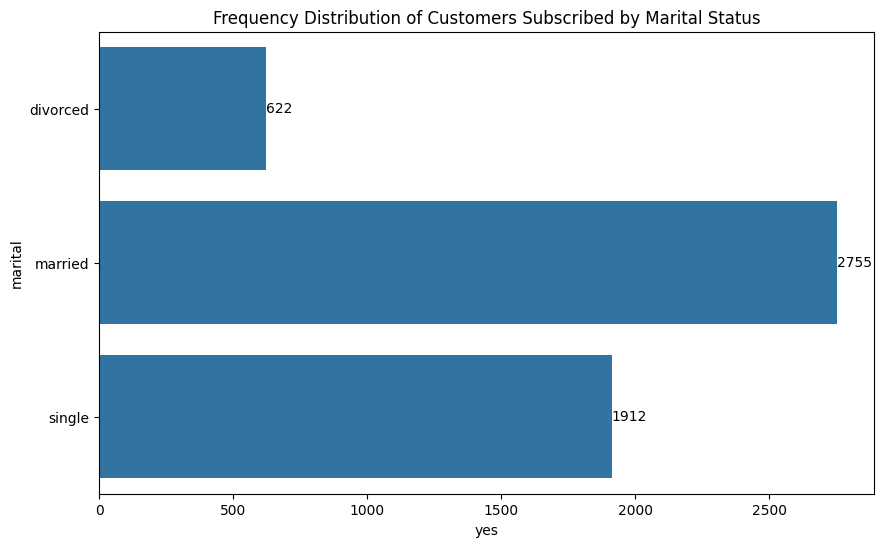
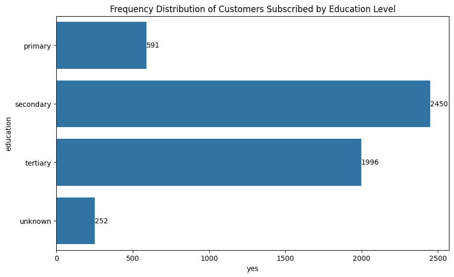

# Chi-square Analysis of Direct Marketing Campaign of Portuguese Banking Institution

## Introduction
A term deposit is a low-risk investment where a customer deposits a certain amount of money for a fixed period in exchange for a guaranteed interest rate. An equivalent amount of the interest rate from the initial deposit is given to the customer either monthly or at an agreed-upon time frame. Banks promote term deposits heavily because these financial products provide important benefits. Marketing term deposits helps banks attract new customers, foster customer loyalty by offering a safe investment option, and meet regulatory capital and funding stability requirements.
## Data and Data Source
This report examines the dataset from a direct marketing campaign conducted by a Portuguese banking institution aimed at encouraging customers to subscribe to a term deposit product. The campaign was executed primarily through telephone calls, where marketing agents contacted both existing and potential customers to present the investment offer. The marketing campaign dataset was sourced from the UCI Machine Learning Resipository(https://archive.ics.uci.edu/dataset/222/bank+marketing) and it comprises detailed information on customers demographics or social status, socioeconomics characteristics, financial behavior, the outcomes of previous campaign and the final actions of each customers whether subscribed or not.

## Objectives

The general objective of this analysis is to establish whether social status of customers can significantly influence their decision in making Term Deposit, while the specific objective is to:
- Determine whether the marketing campaign can be considered a successfull one(if 60% of client subscribe to Term Deposit)
- Determine if there is an association between the job type of customers and subscribing to Term Deposit
- Determine if there is an association between the marital status of customers and subscribing to Term Deposit
- Determine if there is an association between the education background of customers and subscribing to Term Deposit

## Methodology - Chi-square Analysis

Chi-square analysis is a statistical method used to test relationships between caterical variables by comparing observed data to expected outcomes. It helps determine whether differences or associations are statistically significant or due to chance.
- **There are two types of Chi-Square Tests**
1. `Chi-square Goodness of Fit Test` - Tests if a single categorical variable fits a theoretical distribution. For the purpose of this report, chi-square goodness of fit will be used to achieve objective one.
2. `Chi-square Test of Independence` - Tests if two categorical variables are related. For the purpose of this report, chi-square test of independence will be used to achieve every other objectives except objective one.

The Chi-square statistic is calculated as:

$$
X^2 = \sum_{i=1}^{n} \frac{(Obs_i - Exp_i)^2}{Exp_i}    
$$

Where:  

- $\sum$ = Summation for all categories  
- $Obs_i$ = Observed frequency for category *i*  
- $Exp_i$ = Expected frequency for category *i*

$$
Exp_i = \frac{Row_{Total} x Column_{Total}}{Grand_{Total}}
$$

- **Level of Significance = 0.05**

- **Decision rule for hypothesis:** Accept the null hypothesis if p-value < 0.05, otherwise we fail to accept the null hypothesis.

## Analysis - Objective Based

**Objective 1:** Determine whether the marketing campaign can be considered a successfull one(if 60% or more of client subscribe to Term Deposit)

**Hypothesis:**

- H0: 60% or more customers subscribe to term deposit (success).

- H1: 60% or more customers did not subscribe to term deposit (Failure).

**Fig. 1: How customers subscribed to Term Deposit after the campaign**

The Fig. 1 is a piechart which displays the frequency distribution of customers decisions towards subscribing to term deposit at the end of the marketing campaign. About 45,211 customers were marketed in this campaign, of which 39,922(88% approx.) did not subscribe and just 5,289(12% approx.) customers decided to subscribe to term deposit at the end of the marketing campaign. This indicates a very poor return for the bank as very few customers subscribing to the term deposit finacial product can mean a meager amount of money available for running the business of the bank.

**Table 1: Can the campaign be considered a successful one?**

|Statistic  |Chi-Square Goodness of Fit |
|:---------:|:-------------------------:|
|Chi-Square	|15088.719298               |
|Asymp. Sig.|0.00                       |

- **Decision:** Since p-value ($X^2 = 15088.72$, $p-value = 0.00$) < 0.05, we therefore fail to accept the null hypothesis and conclude that 60% or more customers did not subscribe to term deposit after the campaign. That is, based on the objective of this analysis, the marketing campaign can be considered an unsuccessful one.

**Objective 2:** Determine if there is an association between the job type of customers and subscribing to term deposit

**Hypothesis:**

- H0: There is no association between the job type of customers and subscribing to term deposit

- H1: There is association between the job type of customers and subscribing to term deposit

**Fig. 2: How customers subscribe by job types**

The Fig. 2 above is a bar chart which displays how customers subscribe to term deposit by job types. It can be observed that out of the 5,289 of total customers that subscribed to the term deposit, 1,301(25% approx.) were in Management roles, 840(16% approx.) were Technicians, 708(13% approx.) were doing Blue-collar kind of job, 631(12% approx.) were in Admin positions, 516(10% approx.) were retired from their various jobs, while every job types (entrepreneur, housemaid, self-employed, service, student, unemployed and unknown) have less than 500 customers subscribed to term deposit. 

**Table 2: Does job type influences customer decision to subscribe?**

|               |chi-square test    |
|:-------------:|:-----------------:| 
|statistic      |8.361055e+02       |
|p-value        |3.337122e-172      |
|df             |1.100000e+01       |

- **Decision:** Since p-value ($X^2 = 836.11$, df=11, p-value=0.00) < 0.05, we therefore fail to accept the null hypothesis and conclude that there is an association between the job type of customers and subscribing to term deposit. This shows that type of job a customer does can significantly influence customer decision to subscribe term deposit.

**Objective 3:** Determine if there is an association between the marital status of customers and subscribing to term deposit

**Hypothesis**

- H0: There is no association between marital status of customers and subscribing to term deposit

- H1: Tere is an association between marital status of customers and subscribing to term deposit

**Fig. 3: How customers subscribed to Term Deposit by marital status**

The Fig. 3 above is bar chart which displays the frequency distribution of how customers subscribe to term deposit by marital status. Out of the 5,289 customers that subscribe to term deposit, 2,755(52% approx.) were married, 1,912(36% approx.) were single while 622(12% approx.) are divorced. It is obvious from the chart that married customers tends to subscribe to term deposit than customers falling in any other marital status category.

**Table 3: Does customer marital status matters in deciding whether to subscribe to Term Deposit?**

|               |chi-square test    |
|:-------------:|:-----------------:| 
|statistic      |196.4959           |
|p-value        |0.0000             |
|df             |2.0000             |

- **Decision:** Since p-value ($X^2 = 196.5$, df=2, p-value=0.00) < 0.05, we therefore fail to accept the null hypothesis and conclude that there is an association between marital status of customers and subscribing to term deposit. This shows that, marital status of customers can significantly influence their decisions in making term deposit.

4. Determine if there is an association between the education background of background of customers and subscribing to term deposit

**Hypothesis:**

- H0: There is no association between educational level of customers and subscribing to term deposit of the bank

- H1: Tere is an association between educational level of customers and subscribing to term deposit of the bank

**Fig. 4: How education level influences customers decision to subscribe to Term Deposit**

Fig. 4 above is a bar chart displaying how customers that has subscribed to term deposit distributed across the levels of education. 5,289 total customers has subscribed to term deposit after the marketing campaign out of which; 2,450(46% approx.) have secondary education, 1,996(36% approx.) have tertiary education, while 591(11% approx.) have primary education and 252(5% approx.) of the total customers that has subscribed to term deposit of the bank did not know or dislosed their education level. It is noticeable that customers with secondary and tertiary education are the top customers to susbscribe to term deposit of the bank with former returned the highest number of customers.

**Table 4: Does Educational level significantly influences customers decision to subscribe to Term Deposit**

|               |chi-square test    |
|:-------------:|:-----------------:| 
|statistic      |238.9235           |
|p-value        |0.0000             |
|df             |3.0000             |

- **Decision:** Since p-value ($X^2 = 238.92$, df=3, p-value=0.00) < 0.05, we therefore fail to accept the null hypothesis and conclude that there is an association between education level of customers and subscribing to term deposit of the bank. Therefore, we can conclude that education level of customers can statistically and significantly influence their decisions to making term deposit.

## Conclusion

Term Deposit can be referred to as a financial product where a customer commits a certain amount of money for a fixed or predetermined period in exchange for a fixed or agreed interest rate. It is no secret that banks benefit a great deal from such deposits as it would solidify the bank competitive strength and further supply and stabilize bank's capital available for running of the business. The main objective of this analysis is to determine whether social status of customers can influence their decisions in making term deposit for a specific period of time. Using Direct Marketing Campaign of Portuguese Banking Institution dataset secondarily sourced from UCI Machine Learning Resipository which contains 45,211 data points. This report adopted chi-square test to test the hypothesis and achieved the objectives of the report.

It appears the outcome of the marketing campaign would not be the result the bank was hoping for as very little customers out of the total existing and potential customers (45,211) the marketing agents of the bank reached out to eventually make deposit to be fixed for a particular period of time. In this report, social status indicators (job types, marital status, and education level) were suspected to have influence in customers decisions. Therefore, association between these selected social status indicators and customer decision whether to deposit or not was subjected to test. The chi-square test result revealed that job type, marital status and education level all have a statistical significant association with customers decision to subscribe or not subscribe to term deposit of the bank. Customers who engage in jobs such as Management, Technicians, Blue-collar, Administration and Retired customers have high tendency of subscription to term deposit. Customers who are married have higher tendency of subscription followed single then divorced customers. Also, customers who have secondary education have higher chance to subscribe than customers with tertiary and primary education.

In order to overturn the unpleasant outcome of the current marketing campaign, the marketing agents of the bank needs to put into consideration the social status (job types, marital status and education level) of the customers they are reaching out to if these agents are to attain a successful and bank's desirable outcome. In the subsequent campaign, marketing agents should prioritise customers who are in Management positions, Technicians, Admin roles, doing Blue-collar kind of job and retired workers. Marketing agents should also consider reaching out to more married customers as they have potential to subscribe than single and divorced customers. And lastly, marketing agents should also consider customers with secondary education as they possess high chance of subscribing to term deposit than customers with tertiary and primary education.

## Reference

[Moro et al., 2011] S. Moro, R. Laureano and P. Cortez. Using Data Mining for Bank Direct Marketing: An Application of the CRISP-DM Methodology. 
  In P. Novais et al. (Eds.), Proceedings of the European Simulation and Modelling Conference - ESM'2011, pp. 117-121, Guimarães, Portugal, October, 2011. EUROSIS.