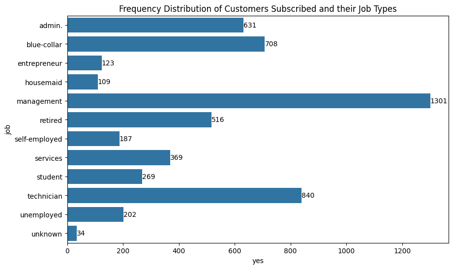

# Chi-square Analysis of Direct Marketing Campaign of Portuguese Banking Institution

## Introduction

A term deposit is a low-risk investment where customer deposit a certain amount of money for a fixed period in exchange for a guaranteed interest rate. Banks market term deposits extensively because these accounts offer them essential benefits. Marketing term deposits helps banks attract new customers, build customer loyalty by providing a safe investment option, and meet regulatory capital and funding stability requirements.
## Data and Data Source
This report examines a direct marketing campaign conducted by a Portuguese banking institution aimed at encouraging customers to subscribe to a term deposit product. The campaign was executed primarily through telephone calls, where marketing agents contacted both existing and potential customers to present the investment offer. The dataset was sourced from the UCI Machine Learning Resipository(https://archive.ics.uci.edu/dataset/222/bank+marketing) and it comprises detailed information on client demographics, socioeconomics characteristics, financial behavior and the outcomes of previous campaign
## Objectives
The general objective of this analysis is to establish whether social status of customers can statistically and significantly influence their decision in making Term Deposit, while the specific objective is to:
- Determine whether the marketing campaign can be considered a successfull one(if 60% of client subscribe to Term Deposit)
- Determine if there is an association between the job type of clients and clients subscribing to Term Deposit
- Determine if there is an association between the marital status of clients and clients subscribing to Term Deposit
- Determine if there is an association between the education background of clients and clients subscribing to Term Deposit
## Methodology - Chi-square Analysis
Chi-square analysis is a statistical method used totest relationships between caterical variables by comparing observed data to expected outcomes. It helps determine wheter differences or associations are statistically significant or due to chance.
- There are two types of Chi-Square Tests
1. `Chi-square Goodness of Fit Test` - Tests if a single categorical variable fits a theoretical distribution. For the purpose of this report, chi-square goodness of fit will be used to achieve objective one.
2. `Chi-square Test of Independence` - Tests if two categorical variables are related. For the purpose of this report, chi-square test of independence will be used to achieve every other objectives except the first one.

The Chi-square statistic is calculated as:

 **χ2 = Σ [(Oi − Ei)2 / Ei]**
 
 **Ei = (Row Total × Column Total) / Grand Total**

Where:  
- **Σ** = Summation for all categories  
- **Oi** = Observed frequency for category *i*  
- **Ei** = Expected frequency for category *i*

- `Decision rule for hypothesis:` Accept the null hypothesis if p-value < 0.05, otherwise we fail to accept the null hypothesis.

## `Analysis`
1. Determine whether the marketing campaign can be considered a successfull one(if 60% or more of client subscribe to Term Deposit)

- `Hypothesis:`

H0: 60% or more customers subscribe to term deposit (success).

H1: 60% or more customers did not subscribe to term deposit (Failure).

Fig. 1: How customers subscribed to Term Deposit after the campaign.

Table 1: Can the campaign be considered a successful one?

|Statistic  |Chi-Square Goodness of Fit |
|:---------:|:-------------------------:|
|Chi-Square	|15088.719298               |
|Asymp. Sig.|0.00                       |

- `Decision:` Since p-value (0.00) < 0.05, we therefore fail to accept the null hypothesis and conclude that 60% or more clients did not subscribe to Term Deposit after the campaign.

2. Determine if there is an association between the job type of customers and clients subscribing to Term Deposit

- `Hypothesis:`

H0: There is no association between the job type of customers and customers subscribing to Term Deposit

H1: There is association between the job type of customers and customers subscribing to Term Deposit

Fig. 2: Customers with which job type should marketing agents focus on?

Table 2: Does job type influences customer decision to subscribe?

|               |chi-square test    |
|:-------------:|:-----------------:| 
|statistic      |8.361055e+02       |
|p-value        |3.337122e-172      |
|df             |1.100000e+01       |

- `Decision:` Since p-value (0.00) < 0.05, we therefore fail to accept the null hypothesis and conclude that there is an association between the job type of customers and customers decision to subscribe to Term Deposit.

3. Determine if there is an association between the marital status of clients and clients subscribing to Term Deposit

- `Hypothesis:`

H0: There is no association between marital status of customers and customers subscribing to Term Deposit

H1: Tere is an association between marital status of customers and customers subscribing to Term Deposit

Table 2: Does customer's marital status matters in their decision to subscribe to Term Deposit?

|               |chi-square test    |
|:-------------:|:-----------------:| 
|statistic      |196.4959           |
|p-value        |0.0000             |
|df             |2.0000             |

- `Decision:` Since p-value (0.00) < 0.05, we therefore fail to accept the null hypothesis and conclude that there is an association between marital status of customers and customer's decision to subscribe to Term Deposit.

4. Determine if there is an association between the education background of clients and clients subscribing to Term Deposit

